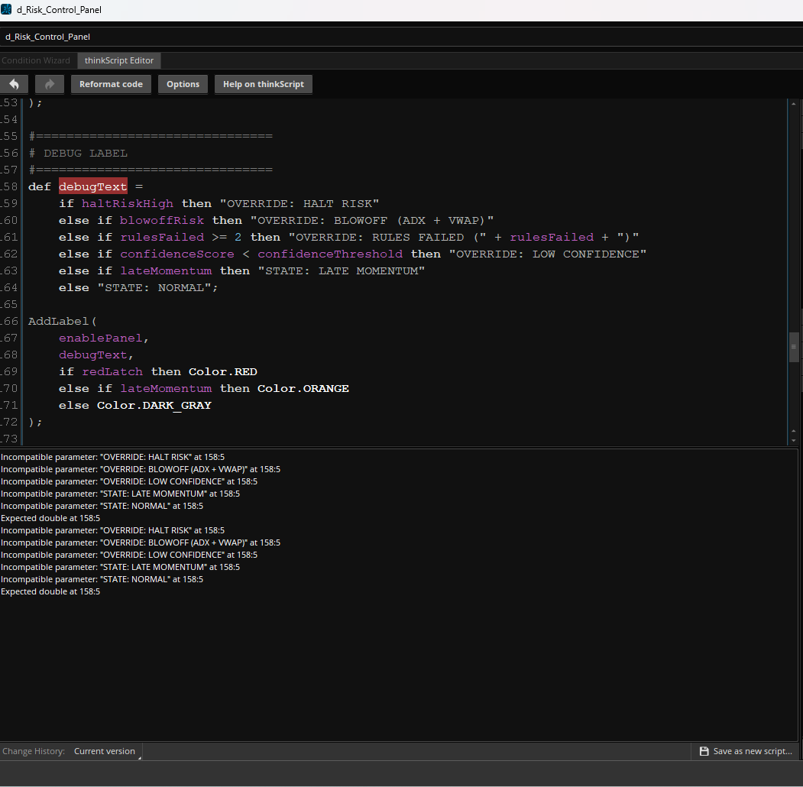
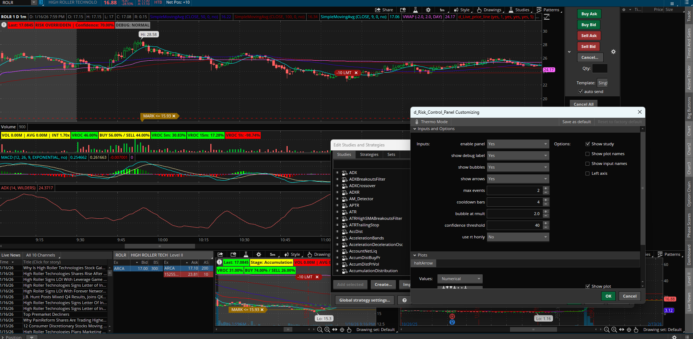

# Context-Aware Risk & Warning System

A portfolio case study in requirements analysis, QA/UAT, troubleshooting, state logic, and decision-support design using Thinkorswim and ThinkScript.

## Project Overview

I designed and iteratively refined a context-aware warning system intended to distinguish routine volume changes from higher-risk combinations of trend, exhaustion, and volume conditions.

The project began with a relatively simple “volume is weakening” concept. Testing showed that the initial approach produced too much noise and did not provide enough context about urgency or cause.

Through repeated testing and refinement, the workflow evolved into a configurable decision-support system with:

- Trend, exhaustion, and volume context
- Graded NORMAL / CAUTION / HALT states
- Risk, confidence, and reason labels
- Cooldown and persistence controls
- Auto-Release behavior
- Configurable chart and interface elements

## My Role

I was responsible for:

- Translating the original concept into explicit requirements and expected behavior
- Defining and refining system logic and user-facing behavior
- Testing iterations directly in Thinkorswim
- Performing QA/UAT against observed chart behavior
- Identifying compiler/type errors and workflow defects
- Diagnosing noisy warnings and persistent or misleading states
- Accepting or rejecting revisions based on test results
- Reconciling the final behavior against the intended requirements

AI was used as a supporting ThinkScript implementation and debugging aid. Requirements, testing decisions, acceptance criteria, and final validation remained human-controlled.

## Development & QA Process

The strongest part of this project is the iteration trail rather than simply the final interface.

Testing identified issues including:

- Compiler and type failures
- Excessively noisy warning behavior
- Insufficient context in early alerts
- State-persistence problems
- HALT conditions that could remain active too long
- Interface and explainability requirements

  ### Debugging and Iteration Evidence

*Early development state showing compiler and type errors identified during ThinkScript testing. The issues were diagnosed, corrected, and retested as part of the iterative QA/UAT process.*

Each finding informed another requirements or implementation revision followed by retesting.

## Configurability

The system includes controls that allow the displayed information and behavior to be adjusted for different usage needs.

Users can enable or disable interface elements such as panels, debugging information, chart bubbles, and arrows, while additional controls expose event limits, cooldown behavior, spacing, thresholds, and other system parameters.

### Configurable Interface and Controls

*Working-state view highlighting configurable display and behavior controls. Users can enable or disable elements such as the panel, debug label, chart bubbles, and arrows, while additional settings expose event limits, cooldown behavior, ATR-based spacing, and confidence thresholds. This supports a cleaner everyday interface while retaining deeper tuning and diagnostic controls when needed.*

This allows the same system to support a cleaner everyday view while retaining deeper configuration and diagnostic controls when needed.

## Skills Demonstrated

- Requirements Analysis
- Quality Assurance
- User Acceptance Testing (UAT)
- Troubleshooting
- Debugging
- Systems Thinking
- Technical Documentation
- Decision-Support Design
- ThinkScript
- AI-Assisted Prototyping

## Project Evidence

This public repository contains selected portfolio-safe evidence from the development process.

The complete private project archive contains additional source material and historical testing evidence that is not published here.

## Scope Note

This is a technical development and QA portfolio case study. It does not claim proven trading performance, guaranteed signal accuracy, or financial returns.
